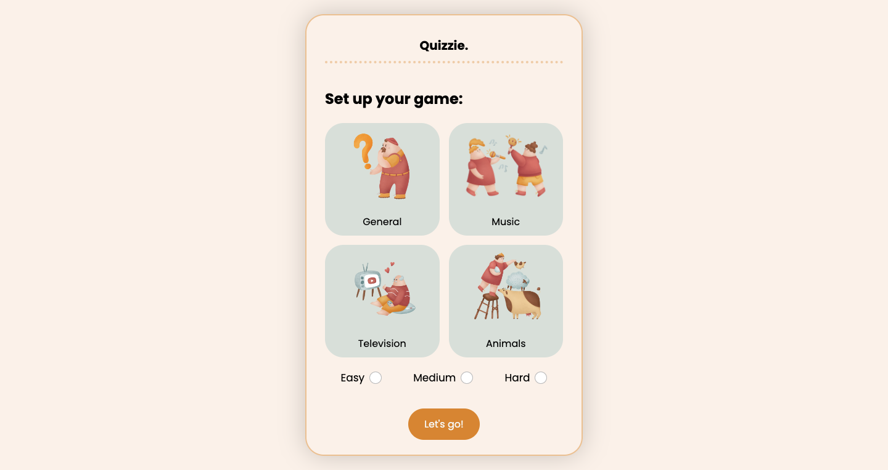

# Quiz App (not responsive)

This is a quiz app with 4 categories that gets the questions from an API, coded with JavaScript (OOP).

You can sign in using:

username: dsz

password: 1111

## Screenshot



## Get started

Install all modules and their dependencies that are listed on package.json file:

```bash
npm install
```

Create the public folder and start the live-server: (save one of the SCSS files afterwards to keep track of the changes correctly)

```bash
npm start
```

## Built with

- HTML
- CSS(SASS)
- JavaScript
